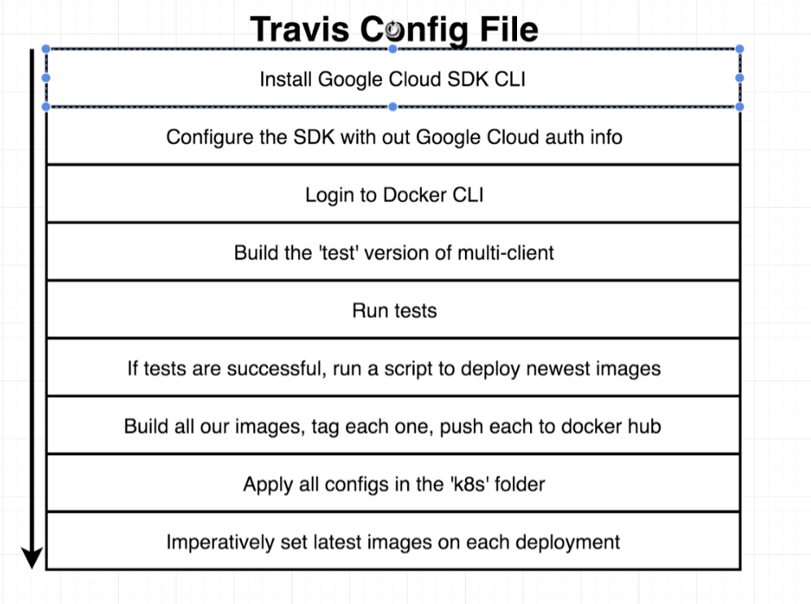
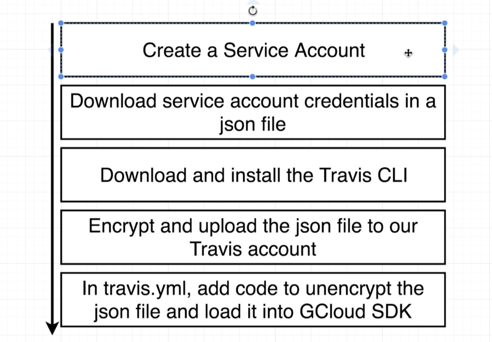
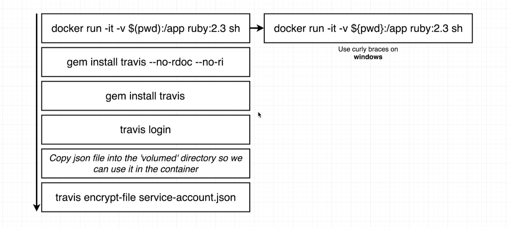

# multi-k8 on GCS

  

## Wire Travis

Google Cloud SDK

### Download Travis cli

Ruby Version Fix
updated 7-27-2020

In the upcoming lecture, we will be installing Travis inside a Docker container. This will now require using the v2.4 version of Ruby instead of v2.3 as shown in the video. The command will now look like this:

docker run -it -v $(pwd):/app -v $HOME/ssh/:$Home/ssh ruby:2.4 sh

With this version, we will no longer be passing the --no-rdoc or --no-ri flags when installing Travis. The command will simply be:

 

 
gem install travis
travis login
travis encrypt-file ssh/jayneservice-account.json -r JayneJacobs/multi-k8

##  [Fixes for Travis "iv undefined" or"repository not known"](docs/../k8s/GoogleCloud/fixesfortravis.md)

 

