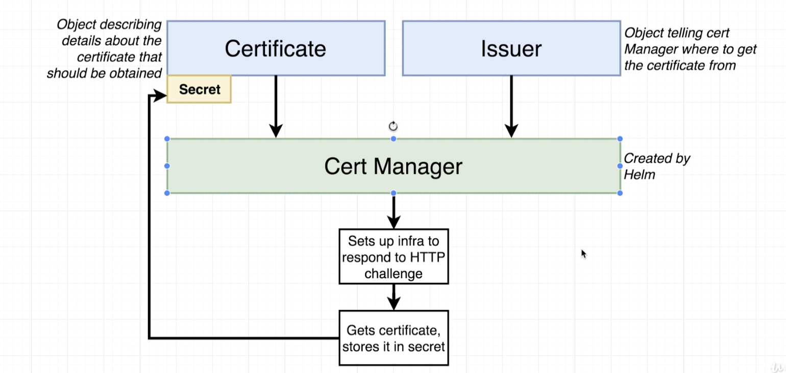

# Fix for Cert Manager Breaking Changes
Installing the Cert Manager using Helm on Google Cloud. 

Changes introduced with v0.11.0 of Cert Manager 

## Cert Manager Installation
The installations steps:

https://docs.cert-manager.io/en/latest/getting-started/install/kubernetes.html#steps

Instead of the installation instructions given at around 1:20 in the video, we will complete these steps by typing into our Cloud Shell:

1. Apply the yaml config file

kubectl apply --validate=false -f https://raw.githubusercontent.com/jetstack/cert-manager/release-0.11/deploy/manifests/00-crds.yaml

2. Create the namespace for cert-manager

kubectl create namespace cert-manager

3. Add the Jetstack Helm repository

helm repo add jetstack https://charts.jetstack.io

4. Update your local Helm chart repository cache

helm repo update

5.  Install the cert-manager Helm chart:

Helm v2:

helm install \
  --name cert-manager \
  --namespace cert-manager \
  --version v0.11.0 \
  jetstack/cert-manager
## Helm v3:

```sh
helm install \
  cert-manager \
  --namespace cert-manager \
  --version v0.11.0 \
  jetstack/cert-manager
```
hostname cs-855179747275-default-default-kprsz

namespaces 

```kubernetes
NAME              STATUS   AGE
cert-manager      Active   5m28s
default           Active   17h
kube-node-lease   Active   17h
kube-public       Active   17h
kube-system       Active   17h
```

issuer.yaml file
In the "Issuer Config File" lecture, the yaml file will need a few small changes per these docs:

https://docs.cert-manager.io/en/latest/tasks/issuers/setup-acme/index.html#creating-a-basic-acme-issuer

1. Make sure to update apiVersion as shown on line 1

2. Add the solvers property

```yaml
apiVersion: cert-manager.io/v1alpha2
kind: ClusterIssuer
metadata:
  name: letsencrypt-prod
spec:
  acme:
    server: https://acme-v02.api.letsencrypt.org/directory
    email: "youremail@email.com"
    privateKeySecretRef:
      name: letsencrypt-prod
    solvers:
      - http01:
          ingress:
            class: nginx
```

certificate.yaml file
In the "Certificate Config File" lecture, only one minor change is required.

1. The only change needed in this file is to update the apiVersion on line 1:

```yaml
apiVersion: cert-manager.io/v1alpha2
```


ingress-service.yaml file
In the "Ingress Config for HTTPS" lecture, we need to change one of the annotations.

certmanager.k8s.io/cluster-issuer: 'letsencrypt-prod'
change to:

```yaml
cert-manager.io/cluster-issuer: "letsencrypt-prod"
``` 
301. Domain Name Setup
303. Cert Manager Install
