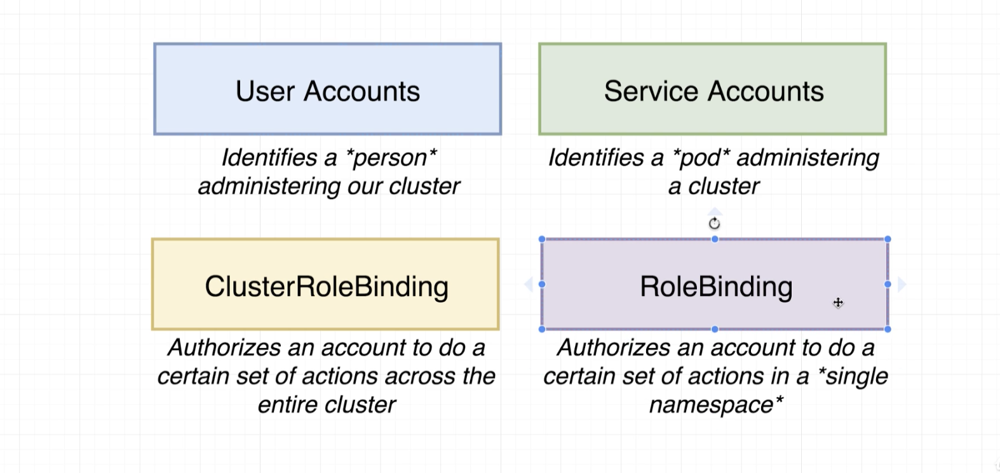

# Helm v3 Update

Latest version of Helm, which is now v3. This is a major update, as it removes the use of Tiller.

1. Install Helm v3:

In your Google Cloud Console run the following:
```sh
curl -fsSL -o get_helm.sh https://raw.githubusercontent.com/helm/helm/master/scripts/get-helm-3
chmod 700 get_helm.sh
./get_helm.sh
 ```
[link to the docs:](https://helm.sh/docs/intro/install/#from-script)


2. Skip the commands 

Helm Setup, Kubernetes Security with RBAC, Assigning Tiller a Service Account and Ingress-Nginx with Helm. You should still watch these lectures and they contain otherwise useful info.

3. Install Ingress-Nginx:

In your Google Cloud Console run the following:

helm repo add ingress-nginx https://kubernetes.github.io/ingress-nginx
helm install my-release ingress-nginx/ingress-nginx
 
[Link to the docs:](https://kubernetes.github.io/ingress-nginx/deploy/#using-helm)

github.com/helm/helm

## RBAC Role Based Access Control

Limits access
Enabled by default



