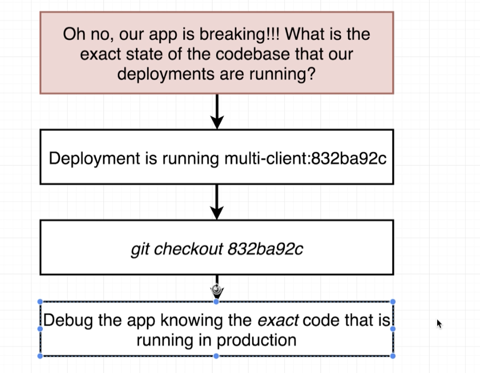

# Google Cloud Deployment

# [Google Price Calculatpr(https://cloud.google.com/products/calculator)

]
git remote remove origin. 
https://console.cloud.google.com/home/dashboard?project=jaynejacobs-007

Set up billing 
Set up project

Shut down the cluster
 https://www.udemy.com/docker-and-kubernetes-the-complete-guide/learn/v4/t/lecture/11684242?start=0

# Wire Travis

#Git SHA

 git rev-parse head
 1[Git_sha](useGit_sha.png)

 Use the sha for debugging

 

[ Update Workflow](UpdateWorkflow)