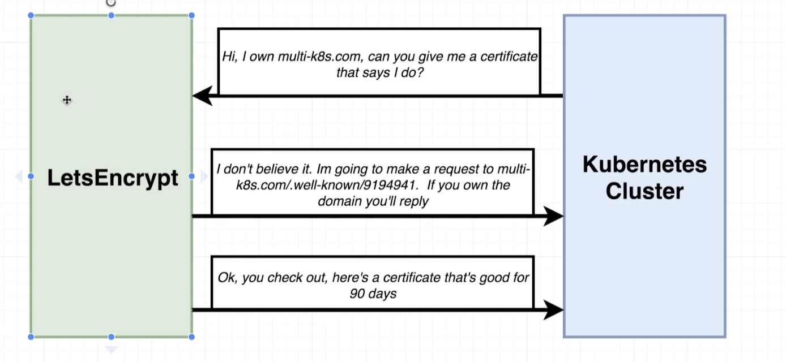

# Git workflow

```process
ø Checkout               -  git checkout -b <name>
ø Update                 - 
ø Commit                 -  git add .; git commit -m "Adding a few more links"; git push
ø push                   -  to branch
ø PR                     -
ø tests                  -  Travis - approve
ø Merge PR tp master     - 
ø Changes.               - 
```

## [Let's Encrypt](FixLetsEncrypt)




Helm tool.  

domain name. fib.jaynejacobs.com


